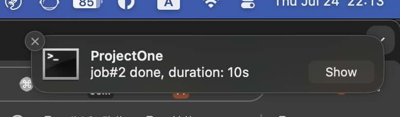

# CCNotify

CCNotify provides desktop notifications for Claude Code, alerting you when Claude needs your input or completes tasks.

## Important Notes

Starting from claude-code v1.0.95 (2025-08-31), any invalid settings in `~/.claude/settings.json` will disable hooks. See [Troubleshooting](#troubleshooting) for solutions.

## Features

- 🔔 **Get notified** when Claude requires your input or completes a task.
- 🔗 **Click to jump back** when notifications are clicked, automatically taking you to the corresponding project in VS Code (macOS only).
- ⏱️ **Task Duration**: Displays started time, and how long the task took to complete
- 🖥️ **Cross-Platform**: Works on macOS, Linux, and Windows

**Note**: Fully compatible with macOS, Linux, and Windows.

## System Requirements

- **Python**: 3.7 or higher
- **Operating System**: macOS, Linux, or Windows
- **Dependencies**: plyer (automatically installed by the installer)
- **Optional**:
  - macOS: terminal-notifier (for enhanced notifications)
  - Linux: libnotify-bin (for native notifications)
  - Windows: No additional tools required

## Installation Guide

### Quick Start (Automated Installation)

The easiest way to install CCNotify is using our automated installation scripts:

#### macOS/Linux

```bash
# Clone or download the repository
git clone https://github.com/dazuiba/CCNotify.git
cd CCNotify

# Run the installation script
chmod +x install.sh
./install.sh
```

#### Windows

```powershell
# Clone or download the repository
git clone https://github.com/dazuiba/CCNotify.git
cd CCNotify

# Run the installation script
.\install.ps1
```

The automated installer will:
- ✓ Verify Python 3.7+ is installed
- ✓ Install required dependencies (plyer)
- ✓ Copy files to the correct location
- ✓ Configure Claude Code hooks automatically
- ✓ Offer to install optional platform-specific notification tools
- ✓ Validate the installation

**Silent Mode**: For non-interactive installation, use:
- Unix: `./install.sh --silent`
- Windows: `.\install.ps1 -Silent`

**Dry Run**: To see what would be done without making changes:
- Unix: `./install.sh --dry-run`
- Windows: `.\install.ps1 -DryRun`

---

### Manual Installation

If you prefer to install manually, choose the instructions for your operating system:

- [macOS Installation](#macos-installation)
- [Linux Installation](#linux-installation)
- [Windows Installation](#windows-installation)

### macOS Installation

#### 1. Install Python Dependencies

```bash
# Install plyer for cross-platform notifications (optional but recommended)
pip install plyer

# Or install from requirements.txt
pip install -r requirements.txt
```

#### 2. Install CCNotify

```bash
# Create the directory if it doesn't exist
mkdir -p ~/.claude/ccnotify

# Copy ccnotify.py to the directory
cp ccnotify.py ~/.claude/ccnotify/

chmod a+x ~/.claude/ccnotify/ccnotify.py

# Test the script, should print: ok
~/.claude/ccnotify/ccnotify.py
```

#### 3. Install terminal-notifier (Recommended for macOS)

For the best notification experience on macOS, install `terminal-notifier`:

```bash
brew install terminal-notifier
```

For alternative installation methods, visit: <https://github.com/julienXX/terminal-notifier>

**Note**: If terminal-notifier is not installed, CCNotify will automatically fall back to using plyer.

#### 4. Configure Claude Hooks

Add the following hooks to your Claude configuration:

**File**: `~/.claude/settings.json`

```json
{
  "hooks": {
    "UserPromptSubmit": [
      {
        "hooks": [
          {
            "type": "command",
            "command": "~/.claude/ccnotify/ccnotify.py UserPromptSubmit"
          }
        ]
      }
    ],
    "Stop": [
      {
        "hooks": [
          {
            "type": "command",
            "command": "~/.claude/ccnotify/ccnotify.py Stop"
          }
        ]
      }
    ],
    "Notification": [
      {
        "hooks": [
          {
            "type": "command",
            "command": "~/.claude/ccnotify/ccnotify.py Notification"
          }
        ]
      }
    ]
  }
}
```

### Linux Installation

#### 1. Install Python Dependencies

```bash
# Install plyer for cross-platform notifications (optional but recommended)
pip3 install plyer

# Or install from requirements.txt
pip3 install -r requirements.txt
```

#### 2. Install CCNotify

```bash
# Create the directory if it doesn't exist
mkdir -p ~/.claude/ccnotify

# Copy ccnotify.py to the directory
cp ccnotify.py ~/.claude/ccnotify/

chmod a+x ~/.claude/ccnotify/ccnotify.py

# Test the script, should print: ok
~/.claude/ccnotify/ccnotify.py
```

#### 3. Install libnotify (Recommended for Linux)

For native Linux notifications, install libnotify:

**Debian/Ubuntu:**

```bash
sudo apt install libnotify-bin
```

**Fedora/RHEL:**

```bash
sudo dnf install libnotify
```

**Arch Linux:**

```bash
sudo pacman -S libnotify
```

**Note**: If libnotify is not installed, CCNotify will automatically fall back to using plyer.

#### 4. Configure Claude Hooks

Add the following hooks to your Claude configuration:

**File**: `~/.claude/settings.json`

```json
{
  "hooks": {
    "UserPromptSubmit": [
      {
        "hooks": [
          {
            "type": "command",
            "command": "~/.claude/ccnotify/ccnotify.py UserPromptSubmit"
          }
        ]
      }
    ],
    "Stop": [
      {
        "hooks": [
          {
            "type": "command",
            "command": "~/.claude/ccnotify/ccnotify.py Stop"
          }
        ]
      }
    ],
    "Notification": [
      {
        "hooks": [
          {
            "type": "command",
            "command": "~/.claude/ccnotify/ccnotify.py Notification"
          }
        ]
      }
    ]
  }
}
```

### Windows Installation

#### 1. Install Python Dependencies

```powershell
# Install plyer for cross-platform notifications (required for Windows)
pip install plyer

# Or install from requirements.txt
pip install -r requirements.txt
```

#### 2. Install CCNotify

```powershell
# Create the directory if it doesn't exist
New-Item -ItemType Directory -Force -Path "$env:USERPROFILE\.claude\ccnotify"

# Copy ccnotify.py to the directory
Copy-Item ccnotify.py "$env:USERPROFILE\.claude\ccnotify\"

# Test the script, should print: ok
python "$env:USERPROFILE\.claude\ccnotify\ccnotify.py"
```

#### 3. Configure Claude Hooks

Add the following hooks to your Claude configuration:

**File**: `%USERPROFILE%\.claude\settings.json`

```json
{
  "hooks": {
    "UserPromptSubmit": [
      {
        "hooks": [
          {
            "type": "command",
            "command": "python %USERPROFILE%\\.claude\\ccnotify\\ccnotify.py UserPromptSubmit"
          }
        ]
      }
    ],
    "Stop": [
      {
        "hooks": [
          {
            "type": "command",
            "command": "python %USERPROFILE%\\.claude\\ccnotify\\ccnotify.py Stop"
          }
        ]
      }
    ],
    "Notification": [
      {
        "hooks": [
          {
            "type": "command",
            "command": "python %USERPROFILE%\\.claude\\ccnotify\\ccnotify.py Notification"
          }
        ]
      }
    ]
  }
}
```

**Note**: On Windows, make sure Python is in your PATH. You can verify by running `python --version` in PowerShell or Command Prompt.

---

## Alternative Installation with UV

[UV](https://github.com/astral-sh/uv) is a fast, modern Python package and project manager. If you prefer using UV for dependency management, follow these instructions:

### Prerequisites

First, install UV if you haven't already:

**macOS/Linux:**

```bash
curl -LsSf https://astral.sh/uv/install.sh | sh
```

**Windows:**

```powershell
powershell -ExecutionPolicy ByPass -c "irm https://astral.sh/uv/install.ps1 | iex"
```

### Installation with UV

1. **Clone or download the CCNotify repository:**

   ```bash
   git clone https://github.com/dazuiba/CCNotify.git
   cd CCNotify
   ```

2. **Install dependencies using UV:**

   ```bash
   # UV will automatically create a virtual environment and install dependencies
   uv sync
   ```

3. **Copy the script to Claude directory:**

   **macOS/Linux:**

   ```bash
   mkdir -p ~/.claude/ccnotify
   cp ccnotify.py ~/.claude/ccnotify/
   chmod a+x ~/.claude/ccnotify/ccnotify.py
   ```

   **Windows:**

   ```powershell
   New-Item -ItemType Directory -Force -Path "$env:USERPROFILE\.claude\ccnotify"
   Copy-Item ccnotify.py "$env:USERPROFILE\.claude\ccnotify\"
   ```

4. **Configure Claude Hooks** as described in the platform-specific installation sections above.

**Note**: UV uses the `pyproject.toml` file to manage dependencies. The traditional `requirements.txt` file is maintained for backward compatibility.

---

## Try It Out

To verify the notification system works, start a new Claude Code session and run:

```
after 1 second, echo 'hello'
```

You should see a desktop notification appear on your system.

## Troubleshooting

### Installation Issues

**Python not found:**
- Ensure Python 3.7+ is installed and in your PATH
- Try `python --version` or `python3 --version` to verify
- macOS: Install via Homebrew: `brew install python3`
- Linux: Install via package manager: `sudo apt install python3` (Debian/Ubuntu)
- Windows: Download from [python.org](https://www.python.org/downloads/) and check "Add Python to PATH"

**pip not available:**
- Try: `python -m ensurepip --upgrade` or `python3 -m ensurepip --upgrade`
- Linux: Install via package manager: `sudo apt install python3-pip`

**Permission denied errors (Unix):**
- Ensure the installation script is executable: `chmod +x install.sh`
- If installing dependencies fails, try: `python3 -m pip install --user plyer`

**Settings.json has invalid JSON:**
- The installer will detect this and refuse to proceed
- Fix JSON syntax errors in `~/.claude/settings.json` before running the installer
- Use a JSON validator or editor with JSON support

**Installation script fails:**
- Run with `--dry-run` to see what would be done: `./install.sh --dry-run`
- Check the error message for specific issues
- Ensure you have write permissions to `~/.claude/` directory

### Notifications Not Appearing

**All Platforms:**

1. Ensure Python dependencies are installed: `pip install plyer`
2. Check the log file for errors: `~/.claude/ccnotify/ccnotify.log` (Unix) or `%USERPROFILE%\.claude\ccnotify\ccnotify.log` (Windows)
3. Verify hooks are configured correctly in `~/.claude/settings.json`

**macOS:**

- Install terminal-notifier for best results: `brew install terminal-notifier`
- Check System Preferences → Notifications to ensure notifications are enabled

**Linux:**

- Install libnotify: `sudo apt install libnotify-bin` (Debian/Ubuntu)
- Ensure your desktop environment supports notifications (GNOME, KDE, XFCE, etc.)

**Windows:**

- Ensure plyer is installed: `pip install plyer`
- Check Windows notification settings (Settings → System → Notifications)
- Make sure Python is in your PATH

### Hooks Not Working

Ensure hooks configuration is active. Here's an example where other configurations prevent hooks from working:

**Test Command:**

```bash
claude -p --model haiku -d hooks --verbose "hi"
```

**Expected output:**

```
[DEBUG] Found 1 hook commands to execute
[DEBUG] Executing hook command: ~/.claude/ccnotify/ccnotify.py UserPromptSubmit with timeout 60000ms
[DEBUG] Hook command completed with status 0: ~/.claude/ccnotify/ccnotify.py UserPromptSubmit
```

**If you see this instead:**

```
[DEBUG] Invalid settings in userSettings source - key: permissions.allow.0, error:.....
[DEBUG] Found 0 hook commands to execute
```

**Reason**: In September 2025, claude-code strengthened validation rules for settings.json. Any invalid configuration will disable hooks.

**Solution**: Modify the relevant configurations in `~/.claude/settings.json` until the `Invalid settings` error stops appearing.

### Platform-Specific Issues

**Windows Path Issues:**

- Use double backslashes in JSON: `"command": "python %USERPROFILE%\\.claude\\ccnotify\\ccnotify.py UserPromptSubmit"`
- Or use forward slashes: `"command": "python %USERPROFILE%/.claude/ccnotify/ccnotify.py UserPromptSubmit"`

**Linux Permission Issues:**

- Ensure the script is executable: `chmod +x ~/.claude/ccnotify/ccnotify.py`
- Check Python 3 is installed: `python3 --version`

**macOS Security:**

- Grant terminal-notifier permissions in System Preferences → Security & Privacy
- Allow notifications for terminal-notifier in System Preferences → Notifications

## How It Works

CCNotify tracks Claude sessions and provides notifications at key moments:

- **When you submit a prompt**: Records the start time and project context
- **When Claude completes**: Calculates duration and sends a completion notification
- **When Claude waits for input**: Immediately alerts you that input is needed

All activity is logged to `ccnotify.log` and session data is stored in `ccnotify.db` locally. No data is uploaded or shared externally.

**Log and Database Locations:**

- **macOS/Linux**: `~/.claude/ccnotify/ccnotify.log` and `~/.claude/ccnotify/ccnotify.db`
- **Windows**: `%USERPROFILE%\.claude\ccnotify\ccnotify.log` and `%USERPROFILE%\.claude\ccnotify\ccnotify.db`

## Uninstall

### Automated Uninstallation (Recommended)

The easiest way to uninstall CCNotify is using our automated uninstallation scripts:

**macOS/Linux:**

```bash
cd CCNotify
./uninstall.sh
```

**Windows:**

```powershell
cd CCNotify
.\uninstall.ps1
```

The uninstaller will:
- Remove CCNotify hooks from settings.json
- Delete installed files
- Optionally remove Python dependencies

**Options:**
- `--keep-data` / `-KeepData`: Keep log files and database
- `--silent` / `-Silent`: Non-interactive mode
- `--dry-run` / `-DryRun`: Show what would be done without making changes

### Manual Uninstallation

If you prefer to uninstall manually:

1. Edit your Claude settings file and remove all hook commands related to `ccnotify`:
   - **macOS/Linux**: `~/.claude/settings.json`
   - **Windows**: `%USERPROFILE%\.claude\settings.json`

2. Remove CCNotify files:

**macOS/Linux:**

```bash
rm -rf ~/.claude/ccnotify
```

**Windows (PowerShell):**

```powershell
Remove-Item -Recurse -Force "$env:USERPROFILE\.claude\ccnotify"
```

3. (Optional) Uninstall Python dependencies:

```bash
pip uninstall plyer
```
